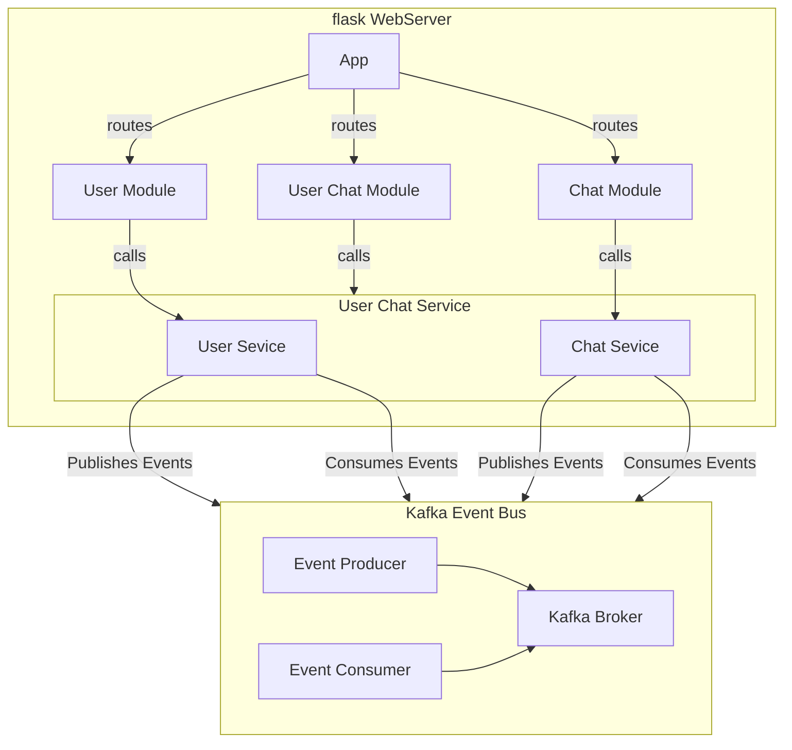
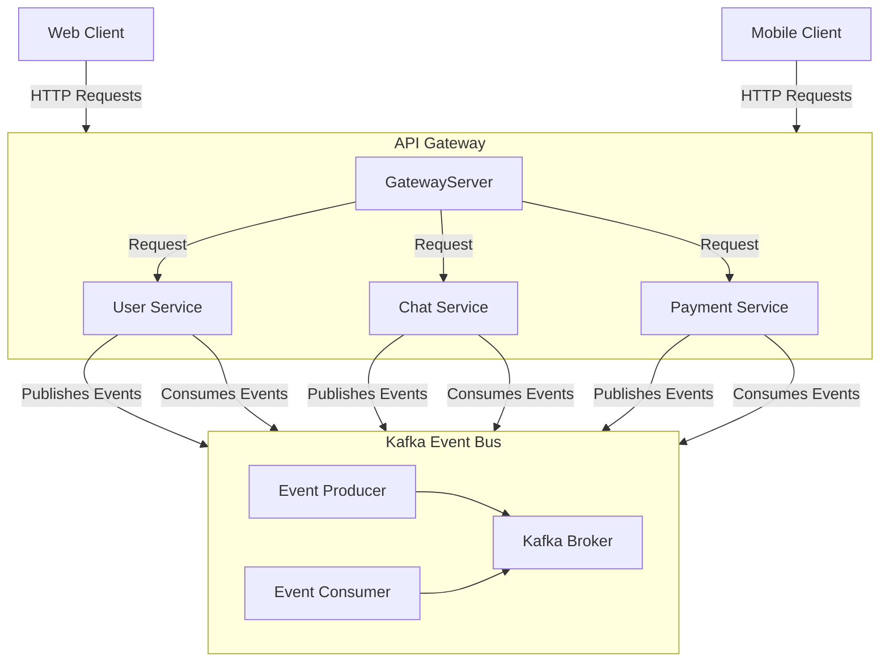
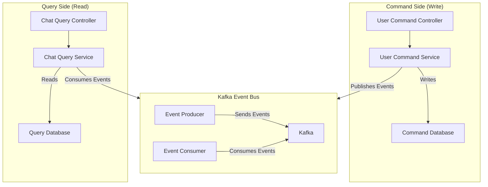

# Flask MSA 시드

flask 프레임워크가 DDD기반의 개발을 하기에 생산성이나 성능면에서 좋지 않다고 생각되어 fastAPI로 이전합니다.

## 1. 서비스 개요

| Category               | description                                                                                         |
| ---------------------- | --------------------------------------------------------------------------------------------------- |
| Concepts               | Domain Driven Design (Subdomains, Bounded Contexts, Ubiquitous Language, Aggregates, Value Objects) |
| Architecture style     | Event Driven Microservices                                                                          |
| Architectural patterns | Event Sourcing, Hexagonal, CQRS                                                                     |
| Technology             | Flask, Kafka, PostgreSQL                                                                            |

## 1. 요구사항

- docker
- docker-compose

## 2. 실행 방법

### 2.1. Deploying(DEV)

```bash
$ sudo docker-compose -f docker-compose.yaml up --build
```

## 3. 서비스 구조도

### 3.1 단일 서버 구성 시



### 3.2 MSA 전환 시



### 3.3. CQRS 구조도



## 4. 서비스 설계

모든 서비스는 단방향 의존 관계를 갖도록 설계해서 상호 참조 문제가 발생하지 않도록 한다. 상호참조가 필요한 경우 그 부분만 별도의 서비스로 만들거나 두 서비스를 하나로 합쳐야 한다. 이 규칙은 서비스, 모듈, 클래스 등 규모에 상관없이 동일하게 적용된다.

### 4.1. 서비스의 분리

이 프로젝트의 서비스는 크게 **Core Serivce**와 **Application Service**로 나눈다

**Core Serivce**의 특징은 다음과 같다.

> 다른 서비스에 존재하지 않는 독립적인 repository를 가진다.
> 다른 서비스를 참조하지 않는다.

**Application Service**의 특징은 다음과 같다.

> repository가 존재하지 않거나 다른 서비스에 존재하는 데이터로 생성 가능한 데이터를 가진다. 다른 서비스를 참조할 수 있다.
